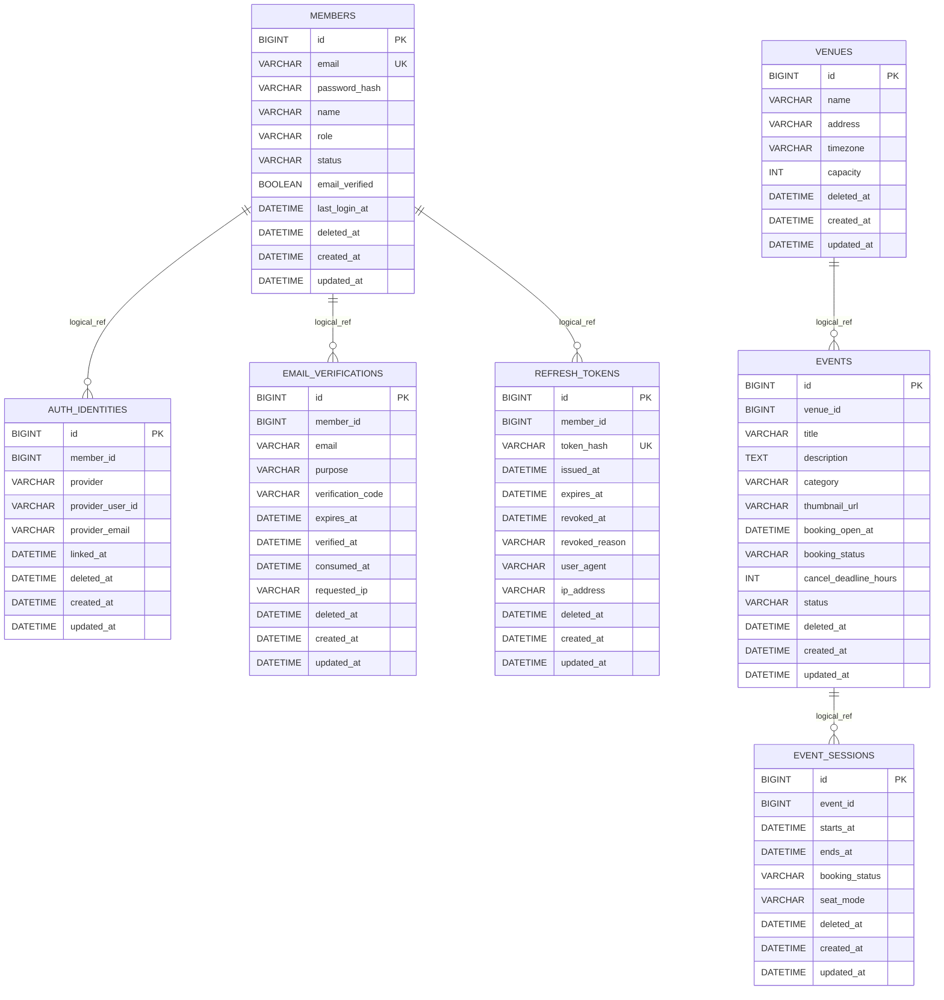

# Database Schema (Soft FK)

> 최종 수정일: 2026-04-01

---

## 1. 목적

- 인증/이벤트 도메인의 초기 스키마를 Flyway 기준으로 관리합니다.
- 확장성과 온라인 마이그레이션 유연성을 위해 물리적 FK를 두지 않습니다.
- 대신 논리 FK 규약, 인덱스 강제, orphan 점검 배치를 통해 정합성을 유지합니다.

---

## 2. 스키마 범위

### 2-1. 인증(Auth)

- `members`
- `auth_identities`
- `email_verifications`
- `refresh_tokens`

### 2-2. 이벤트(Event)

- `venues`
- `events`
- `event_sessions`

### 2-3. 제외 범위

- `seats`, `section_inventories`, `queue`, `bookings`, `payments` 등 후속 슬라이스 테이블

---

## 3. Soft FK 규약

### 3-1. 기본 원칙

- 물리 FK `CONSTRAINT`는 생성하지 않습니다.
- 참조 컬럼은 `*_id` 형식을 사용합니다.
- 참조 컬럼 타입은 대상 PK와 완전히 동일하게 유지합니다.
- 참조 컬럼에는 인덱스를 반드시 생성합니다.

### 3-2. 논리 FK 매핑

- `auth_identities.member_id -> members.id`
- `email_verifications.member_id -> members.id`
- `refresh_tokens.member_id -> members.id`
- `events.venue_id -> venues.id`
- `event_sessions.event_id -> events.id`

---

## 4. 삭제 정책

- 기본 삭제는 soft delete(`deleted_at`)를 사용합니다.
- 사용자/운영자 요청으로 데이터 제거가 필요해도 우선 soft delete로 처리합니다.
- hard delete가 필요한 경우 orphan 점검 후 제한적으로 수행합니다.

---

## 5. 정합성 점검 배치 기준

아래 쿼리는 운영 배치 또는 점검 잡에서 주기적으로 실행합니다.

```sql
-- auth_identities orphan
SELECT ai.id
FROM auth_identities ai
LEFT JOIN members m ON m.id = ai.member_id
WHERE ai.deleted_at IS NULL
  AND (m.id IS NULL OR m.deleted_at IS NOT NULL);

-- email_verifications orphan
SELECT ev.id
FROM email_verifications ev
LEFT JOIN members m ON m.id = ev.member_id
WHERE ev.deleted_at IS NULL
  AND (m.id IS NULL OR m.deleted_at IS NOT NULL);

-- refresh_tokens orphan
SELECT rt.id
FROM refresh_tokens rt
LEFT JOIN members m ON m.id = rt.member_id
WHERE rt.deleted_at IS NULL
  AND (m.id IS NULL OR m.deleted_at IS NOT NULL);

-- events orphan
SELECT e.id
FROM events e
LEFT JOIN venues v ON v.id = e.venue_id
WHERE e.deleted_at IS NULL
  AND (v.id IS NULL OR v.deleted_at IS NOT NULL);

-- event_sessions orphan
SELECT es.id
FROM event_sessions es
LEFT JOIN events e ON e.id = es.event_id
WHERE es.deleted_at IS NULL
  AND (e.id IS NULL OR e.deleted_at IS NOT NULL);
```

---

## 6. 마이그레이션 원칙

- Flyway 스크립트를 스키마의 단일 기준(Source of Truth)으로 사용합니다.
- `spring.jpa.hibernate.ddl-auto`는 모든 프로파일에서 `validate`를 사용합니다.
- 컬럼/인덱스 변경은 Flyway 버전 마이그레이션으로만 반영합니다.

---

## 7. ERD


